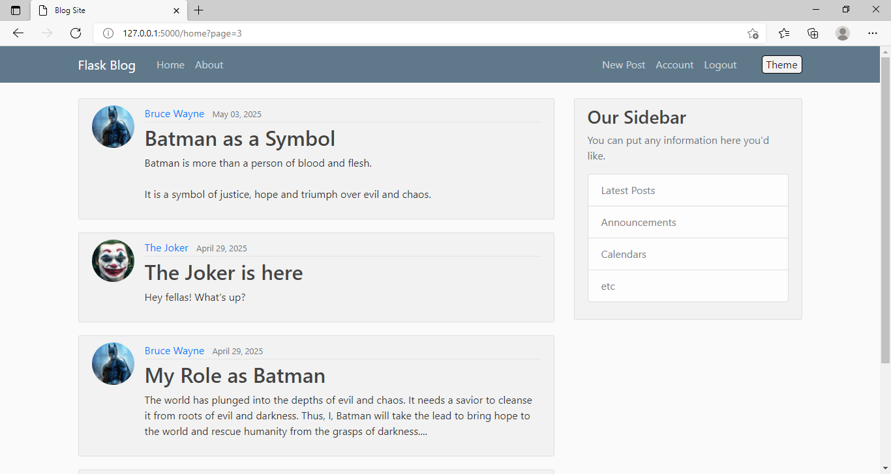
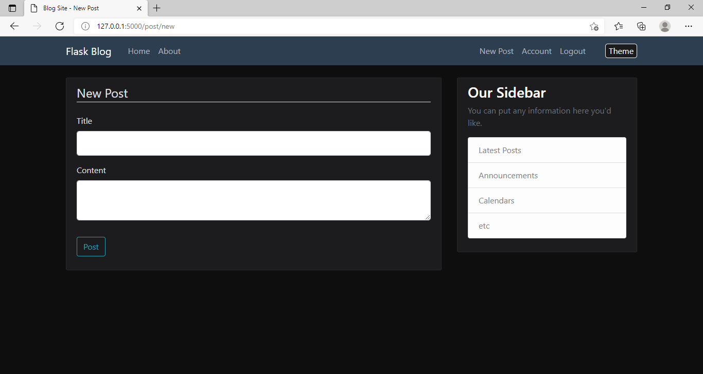
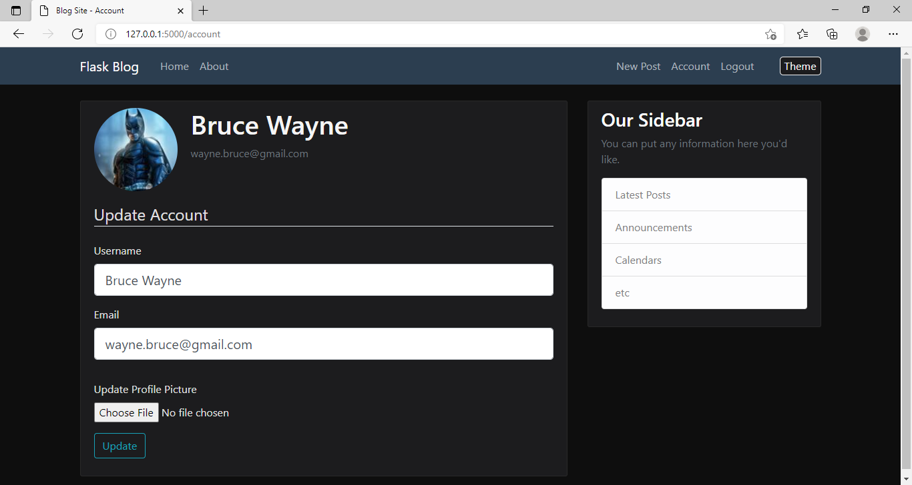
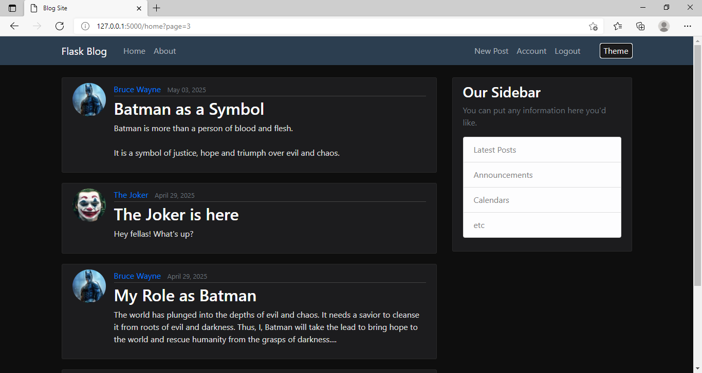
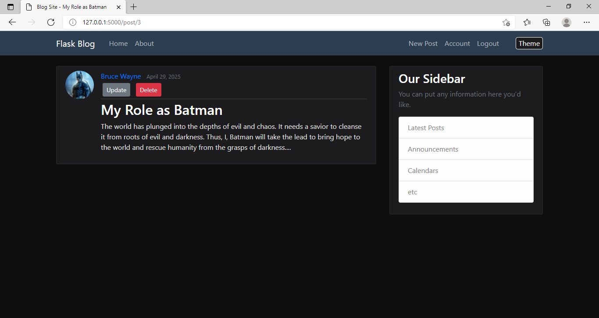
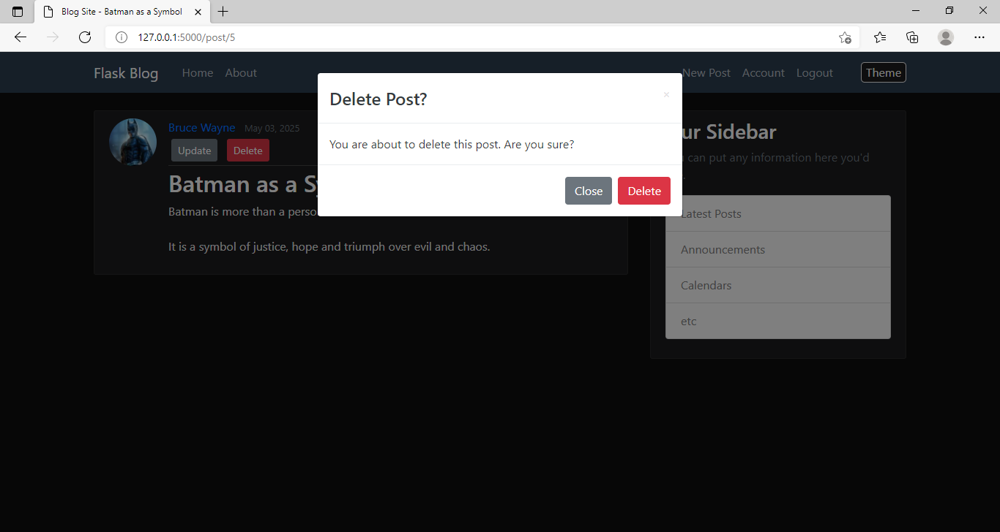

# FlaskVault

A secure and customizable social media platform built with Flask. This app integrates core features of a modern social site with a personal password manager for enhanced security.

## Features

- User authentication with Flask-Login
- Password storage using custom JSON-based encryption
- Profile customization with secure image handling
- Post creation and pagination
- Rate-limiting to prevent brute-force attacks
- YouTube API and Google Drive API support (planned)
- Factory-based Flask application structure
- Encrypted token-based password reset system
- Dark/light mode toggle

## Tech Stack

- **Backend**: Python, Flask, Flask-SQLAlchemy
- **Frontend**: HTML, CSS (Bootstrap), Jinja2
- **Database**: SQLite (for now)
- **Security**: Flask-Limiter, Timed JSON Web Tokens, bcrypt

## Screenshots 









## Getting Started

1. Clone the repository:
   ```bash
   git clone https://github.com/avik43218/flaskvault.git
   cd flaskvault
```
2. Create and activate a virtual environment:
   ```bash
   python -m venv venv
   source venv/bin/activate   # on Windows use venv/Scripts/activate
```
3. Install dependencies:
   ```bash
   pip install -r requirements.txt
```
4. Run the app:
   ```bash
   flask run
```

## Security Notes

- All sensitive user data is encrypted and stored securely
- Login attempts are rate-limited
- Password reset links are secured via timed tokens
- Profile images are resized and sanitized before storage


## Future Plans

- Full-featured dashboard with stats and insights
- Multimedia upload system
- Integration with YouTube API for videos and Google Drive API for other data and backups

## Acknowledgements

- [Corey Schafer](https://youtube.com/@coreyms?si=cii33Jp_LjCTbH1h): For his excellent Flask and Python tutorials
- Stack Overflow: For endless bug solutions
- Flask Documentation: For comprehensive and well-structured reference material
- OpenAI's ChatGPT: For development support, debugging, and technical brainstorming

## License

This project is licensed under the [MIT License](./LICENSE).
